# 🔥 Enhancing Building Safety through Machine Learning and Deep Learning Based Smoke Detection

> **Major Project — Bachelor of Engineering in Computer Science and Engineering (AIML)**
> Lords Institute of Engineering and Technology (UGC Autonomous), Hyderabad
> Academic Year 2025–2026

[](https://python.org)
[](https://djangoproject.com)
[](https://tensorflow.org)
[](https://ultralytics.com)
[](https://scikit-learn.org)
[](https://railway.app)
[](LICENSE)

---

## 📌 Project Overview

This project presents an intelligent building safety system that detects fire and smoke using a dual-module approach:

- **ML Module** — Seven classical machine learning classifiers trained on a real-world IoT sensor dataset (62,630 readings, 13 sensor channels) achieve near-perfect AUC-ROC scores above 0.999.
- **DL Module** — A MobileNetV2 CNN trained via transfer learning achieves 96.98% validation accuracy on fire/no-fire image classification. A YOLOv8 object detection model draws bounding boxes around fire and smoke regions on the same prediction page.

The entire system is delivered as a full-stack Django web application accessible through any browser.

---

## 👥 Team Roles

| # | Name | Roll Number | Role |
|---|------|-------------|------|
| 1 | M.A. Omer | 160922748048 | AI/ML & System Architect |
| 2 | Syed Abdul Wasay | 160922748015 | Full Stack Developer & ML training |
| 3 | Syed Afeef ul Luqman | 160922748037 | Testing & Quality Assurance |
| 4 | Mohammed Muneebuddin Ahmed | 160922748060 | Documentation & Research |

**Project Guide:** Dr. Mohammed Tajuddin, Associate Professor
**Co-Guide / HoD:** Dr. Abdul Rasool MD, Associate Professor & Head of Department, CSE (AIML)
**Institution:** Lords Institute of Engineering and Technology, Hyderabad

---

## 📚 Table of Contents

1. [About](#-about)
2. [Screenshots](#-screenshots)
3. [Features](#-features)
4. [Tech Stack](#-tech-stack)
5. [Architecture](#-architecture)
6. [Quick Start](#-quick-start)
7. [Environment Variables](#-environment-variables)
8. [Manual Installation](#-manual-installation)
9. [Troubleshooting](#-troubleshooting)
10. [License](#-license)

---

## 🧠 About

Traditional smoke and fire detection systems rely on single-sensor threshold triggers — photoelectric or ionization sensors that fire alarms when particulate density crosses a fixed value. These systems suffer from:

- **High false alarm rates** — Cooking smoke, steam, dust, and humidity fluctuations cause unnecessary evacuations
- **Missed early detections** — Slow-burning smouldering fires with lower particulate output go undetected
- **No spatial awareness** — Responders cannot identify the exact origin of smoke or fire

**SmokeGuard AI** addresses all three limitations with a dual-module intelligent pipeline:

**Module 1 — Sensor-Based ML Detection**
Analyses 13 simultaneous IoT sensor readings (temperature, humidity, CO₂, TVOC, particulate matter, etc.) and classifies whether a fire alarm condition exists. Seven classifiers are trained and compared, and users can select any model at prediction time.

**Module 2 — Image-Based Deep Learning Detection**
Accepts uploaded images and runs two detection passes:
- **CNN Classification** — MobileNetV2 classifies the whole image as fire/no-fire with confidence percentage
- **YOLO Detection** — YOLOv8 draws precise bounding boxes around fire and smoke regions, providing spatial localization

Both modules are integrated into a unified role-based Django 5.2 web application with separate portals for administrators and users.

---

## 📸 Screenshots

### 🏠 Homepage — SmokeGuard AI
> Dark tactical interface with animated background and dual portal access

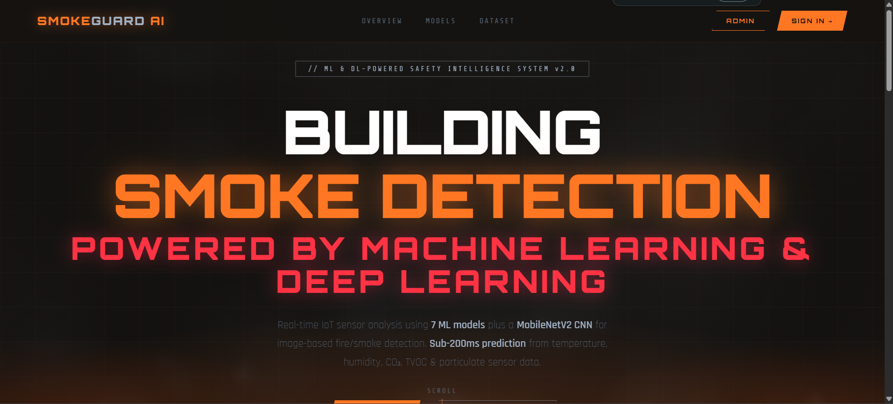

---

### 🔐 Authentication
| User Login | Admin Login | User Registration |
|-----------|------------|------------------|
| 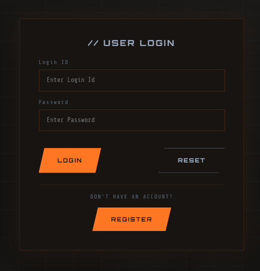 | 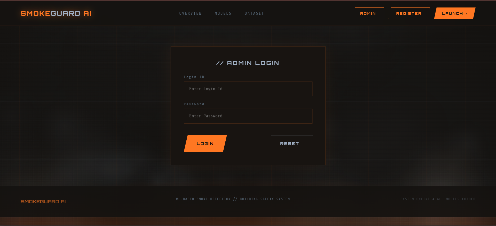 | 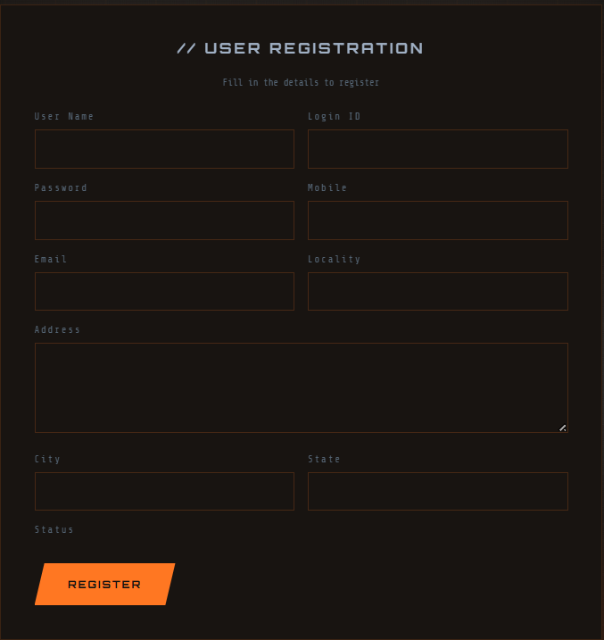 |

---

### 📊 Admin Portal
| Admin Dashboard | Registered Users Management |
|----------------|----------------------------|
| 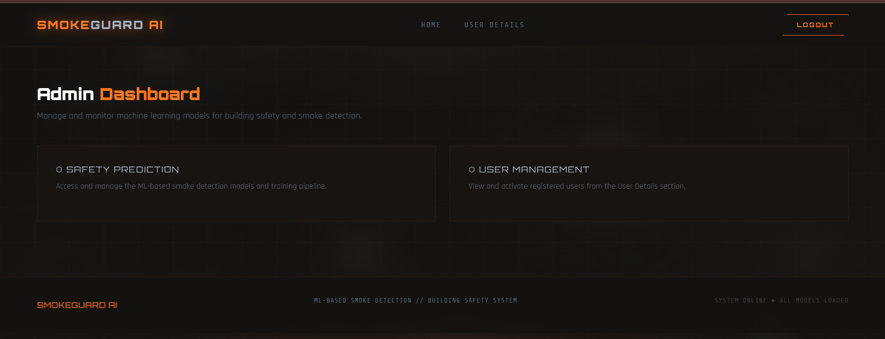 | 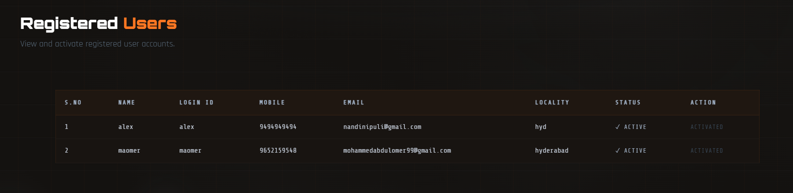 |

---

### 👤 User Portal

**User Home — Feature Overview**
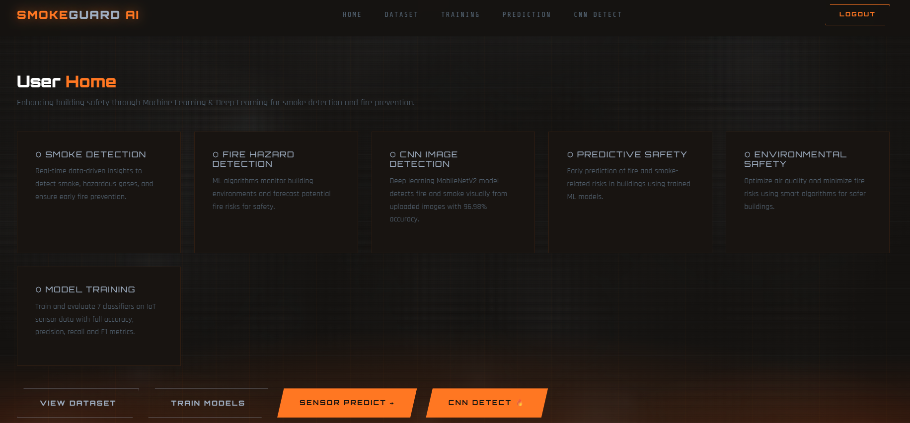

**Dataset Browser — 62,630 IoT Sensor Records**
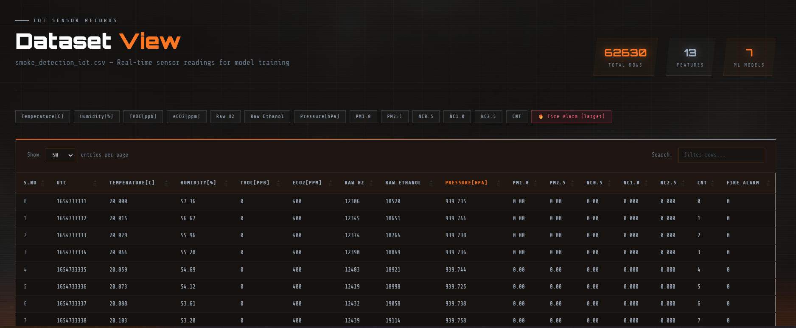

---

### 🤖 ML Training & Evaluation
> Train all 7 classifiers simultaneously with live progress bars, accuracy comparison charts, and a full metrics table

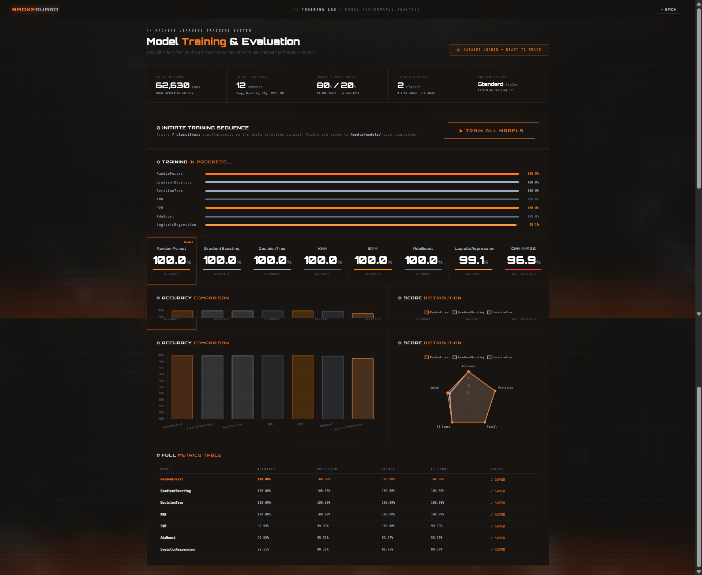

---

### 📡 Sensor-Based Prediction

| No Smoke Detected | Smoke Detected |
|------------------|---------------|
| 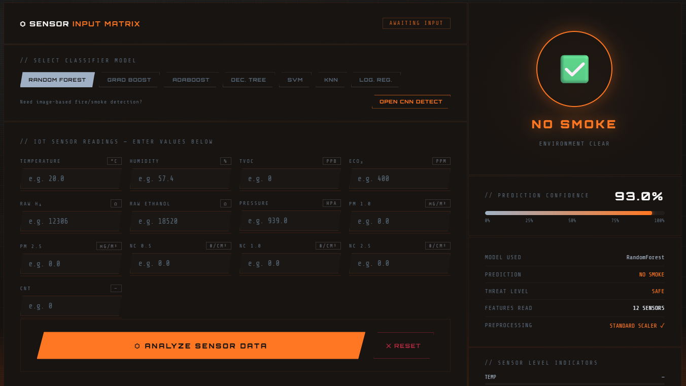 | 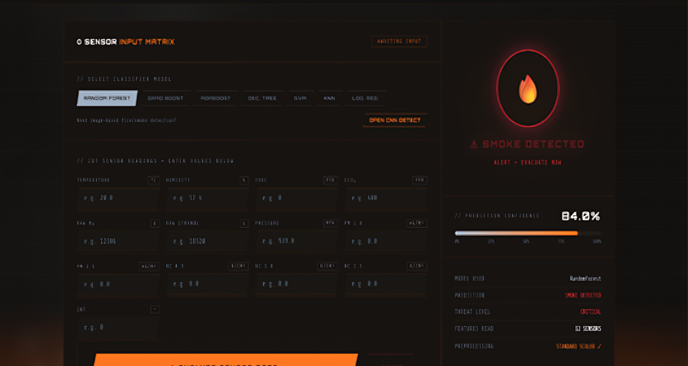 |

> Enter 13 IoT sensor values, select a classifier model, and receive instant threat-level assessment with confidence score

---

### 🖼️ CNN + YOLO Image Detection

**Fire Detected (99.9% Confidence)**
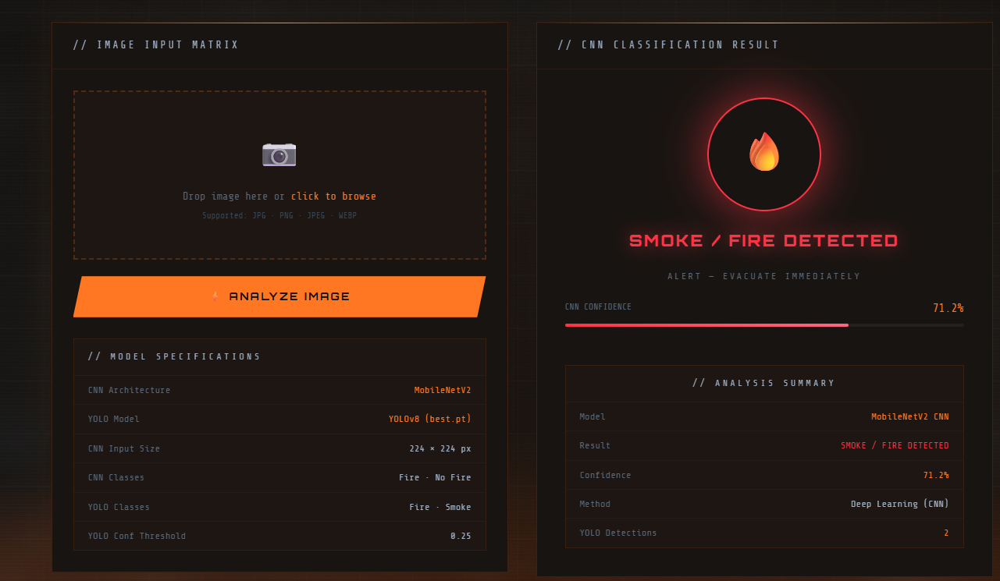

**No Smoke Detected (86.6% Confidence)**
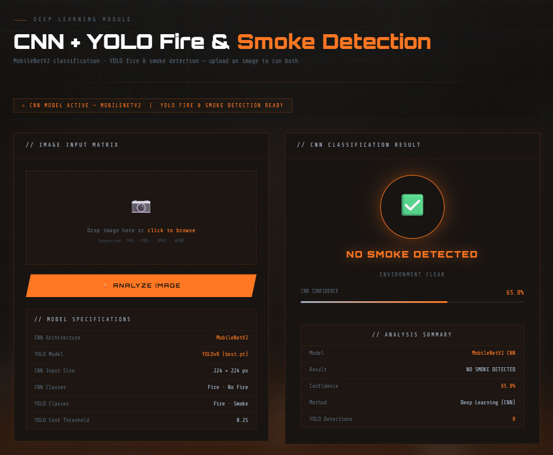

**YOLO Bounding Box Analysis — Fire & Smoke Spatial Localization**

> YOLOv8 draws colour-coded bounding boxes — red for fire, cyan for smoke — with confidence scores on the annotated output image

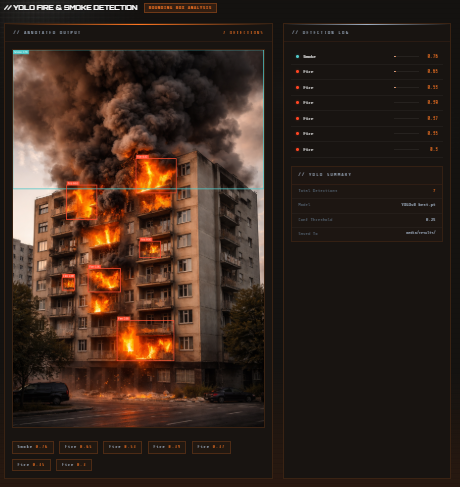

---

## ✨ Features

| Feature | Description |
|---------|-------------|
| 🔐 Role-Based Authentication | Separate admin and user portals with session-based login and PBKDF2 password hashing |
| 👤 User Registration & Activation | Users register and await admin approval before accessing the system |
| 📊 Dataset Browser | Browse all 62,630 IoT sensor rows with pagination, column headers, and live search |
| 🤖 ML Model Training | Train all 7 classifiers on-demand with live progress bars, accuracy charts, and radar plots |
| 📡 Sensor Prediction | Enter 13 sensor readings, select any trained classifier, and receive instant fire/no-fire result with confidence |
| 🖼️ CNN Image Classification | Upload an image — MobileNetV2 returns fire/no-fire verdict with confidence percentage |
| 🔲 YOLO Fire & Smoke Detection | YOLOv8 draws colour-coded bounding boxes (red for fire, cyan for smoke) on the uploaded image |
| 📈 Performance Metrics | Precision, Recall, F1, AUC-ROC, Accuracy, and IoU displayed per model |
| 👤 Admin Dashboard | View all registered users, activate or deactivate accounts |

---

## 🛠️ Tech Stack

| Layer | Technology | Version |
|-------|-----------|---------|
| Web Framework | Django | 5.2 |
| ML Library | Scikit-Learn | 1.6.1 |
| Deep Learning | TensorFlow / Keras | 2.10.0 |
| Object Detection | Ultralytics YOLOv8 | 8.4.21 |
| Computer Vision | OpenCV Headless | 4.8.1.78 |
| Image Drawing | Pillow (PIL) | 10.3.0 |
| Data Processing | Pandas | 2.2.3 |
| Numerical Computing | NumPy | 1.26.4 |
| Model Serialization | Joblib | 1.3.2 |
| Frontend | Bootstrap 5 + Chart.js | 5.3 / 3.x |
| Database | SQLite (Django ORM) | Built-in |
| WSGI Server | Gunicorn | 21.2.0 |
| Static Files | WhiteNoise | 6.7.0 |
| Config Management | python-decouple | 3.8 |
| Deployment | Railway | — |
| Python | CPython | 3.10.13 |

---

## 🏗️ Architecture

```
┌─────────────────────────────────────────────────────────────┐
│                     SmokeGuard AI — Django 5.2              │
├───────────────────────────┬─────────────────────────────────┤
│        Admin Portal       │          User Portal             │
│  /admin-login/            │  /user-login/                   │
│  /admin-home/             │  /home/                         │
│  /view-users/             │  /dataset/                      │
│  /activate/<id>/          │  /train/                        │
│                           │  /predict/                      │
│                           │  /cnn-prediction/               │
├───────────────────────────┴─────────────────────────────────┤
│                     ML MODULE                               │
│  smoke_detection_iot.csv → StandardScaler → 7 Classifiers  │
│  RandomForest | GradBoost | AdaBoost | LR | SVM | DT | KNN │
├─────────────────────────────────────────────────────────────┤
│                     DL MODULE                               │
│  Image Upload → MobileNetV2 CNN (96.98% acc)               │
│               → YOLOv8 (best.pt) Bounding Box Detection    │
│               → Pillow ImageDraw (no OpenGL dependency)    │
├─────────────────────────────────────────────────────────────┤
│                     STORAGE                                 │
│  media/models/*.pkl  │  media/cnn_model.h5                 │
│  media/scaler.pkl    │  media/models/best.pt               │
│  media/uploads/      │  media/results/                     │
└─────────────────────────────────────────────────────────────┘
```

### Project File Structure

```
Project Root/
│
├── manage.py                        # Django management entry point
├── train_cnn.py                     # Standalone CNN training script
├── postinstall.py                   # Railway deployment fix (OpenCV headless swap)
├── requirements.txt                 # All pinned dependencies
├── Procfile                         # Gunicorn process declaration
├── nixpacks.toml                    # Railway build configuration
├── .python-version                  # Forces Python 3.10.13 on Railway
├── .gitignore
├── db.sqlite3                       # SQLite database
├── METHODOLOGY.md                   # Project methodology notes
├── README.md
│
├── Buliding_Saftey_Through_Machine_learning/   # Django project config
│   ├── settings.py
│   ├── urls.py
│   ├── wsgi.py
│   └── asgi.py
│
├── admins/                          # Admin Django app
│   ├── views.py                     # Admin login, dashboard, user management
│   ├── models.py
│   └── migrations/
│
├── users/                           # Users Django app
│   ├── views.py                     # Dataset, training, prediction, CNN+YOLO
│   ├── models.py                    # UserRegistrationModel
│   ├── forms.py
│   └── migrations/
│
├── templates/                       # All HTML templates (root level)
│   ├── base.html                    # Shared base layout
│   ├── index.html                   # Homepage
│   ├── AdminLogin.html
│   ├── UserLogin.html
│   ├── UserRegistrations.html
│   ├── admins/
│   │   ├── adminbase.html
│   │   ├── AdminHome.html
│   │   └── viewregisterusers.html
│   └── users/
│       ├── userbase.html
│       ├── UserHomePage.html
│       ├── viewdataset.html
│       ├── training.html
│       ├── predict_form.html
│       └── cnn_predict.html
│
├── static/
│   └── imgs/                        # Static images
│
└── media/                           # All model files, datasets, and outputs
    ├── cnn_model.h5                 # Trained MobileNetV2 CNN (< 100 MB)
    ├── cnn_classes.json             # Class index map {"fire": 0, "no_fire": 1}
    ├── scaler.pkl                   # Fitted StandardScaler
    ├── smoke_detection_iot.csv      # IoT sensor dataset (62,630 rows)
    ├── models/                      # Trained ML classifiers + YOLO weights
    │   ├── RandomForest.pkl
    │   ├── GradientBoosting.pkl
    │   ├── AdaBoost.pkl
    │   ├── DecisionTree.pkl
    │   ├── LogisticRegression.pkl
    │   ├── KNN.pkl
    │   ├── SVM.pkl
    │   └── best.pt                  # YOLOv8 weights (61 MB)
    ├── cnn_dataset/                 # CNN training images
    │   ├── fire/                    # 755 fire images (fire.1.png … fire.755.png)
    │   └── no_fire/                 # 244 non-fire images
    ├── uploads/                     # User-uploaded images (UUID-named)
    └── results/                     # YOLO-annotated output images (yolo_<uuid>.jpg)
```

---

## ⚡ Quick Start

> **Prerequisites:** [Anaconda](https://anaconda.org) or [Miniconda](https://docs.conda.io/en/latest/miniconda.html) installed

```bash
# 1. Clone the repository
git clone https://github.com/MOHD-OMER/Building-Safety-Smoke-Detection.git
cd Building-Safety-Smoke-Detection

# 2. Create and activate the conda environment
conda create -n smoke python=3.10
conda activate smoke

# 3. Install all dependencies
pip install -r requirements.txt

# 4. Apply database migrations
python manage.py migrate

# 5. Train the CNN model (first time only — ~5 minutes with GPU)
python train_cnn.py

# 6. Start the development server
python manage.py runserver
```

Visit **http://127.0.0.1:8000/** in your browser.

| Portal | URL | Credentials |
|--------|-----|-------------|
| User Portal | http://127.0.0.1:8000/ | Register a new account |
| Admin Portal | http://127.0.0.1:8000/admin-login/ | `admin` / `admin` |

---

## 🔑 Environment Variables

Create a `.env` file in the project root (same directory as `manage.py`):

```env
SECRET_KEY=your-secret-key-here
DEBUG=True
```

For **Railway production deployment**, set these variables in the Railway dashboard:

| Variable | Value |
|----------|-------|
| `SECRET_KEY` | A long, random secret string |
| `DEBUG` | `False` |

> The project uses `python-decouple` to read `.env` files. Never commit your `.env` file to version control.

---

## 🔧 Manual Installation

If you prefer not to use conda, follow these steps with a standard Python 3.10 virtual environment:

### Step 1 — Create a virtual environment

```bash
python3.10 -m venv smoke_env
source smoke_env/bin/activate        # Linux / macOS
smoke_env\Scripts\activate           # Windows
```

### Step 2 — Install dependencies

```bash
pip install --upgrade pip
pip install -r requirements.txt
```

### Step 3 — Fix OpenCV for headless environments (Linux servers)

```bash
pip uninstall opencv-python -y
pip install opencv-python-headless==4.8.1.78 --no-deps --force-reinstall
pip install numpy==1.26.4 --force-reinstall
```

### Step 4 — Apply migrations and collect static files

```bash
python manage.py migrate
python manage.py collectstatic --noinput
```

### Step 5 — Train the CNN model

```bash
python train_cnn.py
```

> Training takes approximately **5 minutes on GPU** (NVIDIA RTX 3050 Ti) or **10–15 minutes on CPU**.
> The trained model is saved to `media/cnn_model.h5`.

### Step 6 — Run the server

```bash
# Development
python manage.py runserver

# Production (Gunicorn)
gunicorn Buliding_Saftey_Through_Machine_learning.wsgi --bind 0.0.0.0:8000 --workers 1 --timeout 120
```

---

## 📈 ML Model Performance

All seven classifiers were trained on 62,630 IoT sensor readings (80/20 train-test split) with StandardScaler preprocessing.

| Model | Precision | Recall | F1 Score | AUC-ROC |
|-------|-----------|--------|----------|---------|
| Random Forest | ~100% | ~100% | ~100% | ~100% |
| Gradient Boosting | ~100% | ~100% | ~100% | ~100% |
| AdaBoost | ~99.9% | ~99.9% | ~99.9% | ~100% |
| Logistic Regression | ~99.3% | ~99.0% | ~99.1% | ~99.9% |
| SVM | ~100% | ~99.9% | ~100% | ~100% |
| Decision Tree | ~99.9% | ~99.9% | ~99.9% | ~99.9% |
| KNN | ~100% | ~100% | ~100% | ~100% |

**CNN (MobileNetV2) Validation Accuracy:** `96.98%`
**YOLO (YOLOv8) Confidence Threshold:** `0.25`

---

## 🌐 Live Demo

🔗 **[https://building-safety-smoke-detection-production.up.railway.app](https://building-safety-smoke-detection-production.up.railway.app)**

> Hosted on Railway (asia-southeast1). CNN inference may take 8–10 seconds on the free-tier CPU-only server.

---

## 🐛 Troubleshooting

### `libGL.so.1: cannot open shared object file`

**Cause:** `ultralytics` imports `opencv-python` (GUI build) which requires OpenGL — not available on headless Linux servers.

**Fix:**
```bash
pip uninstall opencv-python -y
pip install opencv-python-headless==4.8.1.78 --no-deps --force-reinstall
pip install numpy==1.26.4 --force-reinstall
```

---

### `numpy` version conflicts after OpenCV reinstall

**Cause:** `opencv-headless` may pull a newer NumPy (2.x) which breaks TensorFlow 2.10.

**Fix:**
```bash
pip install numpy==1.26.4 --force-reinstall
```

---

### `CSRF verification failed` (403 error) on Railway

**Cause:** Railway sits behind a reverse proxy and Django blocks cross-origin form submissions.

**Fix:** Ensure `settings.py` contains:
```python
CSRF_TRUSTED_ORIGINS = ['https://*.up.railway.app']
SECURE_PROXY_SSL_HEADER = ('HTTP_X_FORWARDED_PROTO', 'https')
```

---

### Railway uses Python 3.13 instead of 3.10

**Cause:** Railway's Railpack defaults to the latest Python version. TensorFlow 2.10 only supports Python 3.7–3.10.

**Fix:** Ensure `.python-version` file exists in the project root:
```
3.10.13
```

---

### `torch` download times out during Railway build

**Cause:** Default PyTorch pulls the full GPU build (~915 MB).

**Fix:** Install CPU-only PyTorch from the official wheel index:
```bash
pip install torch --index-url https://download.pytorch.org/whl/cpu
```

---

### `cnn_model.h5` not found

**Cause:** The CNN model has not been trained yet, or the file was not committed to the repository.

**Fix:**
```bash
python train_cnn.py
```
Ensure the generated `media/cnn_model.h5` file is committed to git (it is under 100 MB and within GitHub's limit).

---

### Static files not loading on Railway (`404` for CSS/JS)

**Cause:** Django does not serve static files in production (`DEBUG=False`) without a dedicated handler.

**Fix:** Ensure `WhiteNoise` is installed and configured in `settings.py`:
```python
MIDDLEWARE = [
    'whitenoise.middleware.WhiteNoiseMiddleware',
    # ...
]
STATICFILES_STORAGE = 'whitenoise.storage.CompressedManifestStaticFilesStorage'
```

---

## 📄 License

This project is licensed under the **MIT License** — see the [LICENSE](LICENSE) file for full details.

Submitted as a Major Project for the partial fulfillment of the award of Bachelor of Engineering at **Lords Institute of Engineering and Technology, Hyderabad**. All academic rights are reserved by the project team.

---

<div align="center">

**SmokeGuard AI**
Lords Institute of Engineering and Technology, Hyderabad
B.E. CSE (AIML) — 2025–2026

*Built with ❤️ by Team*

</div>